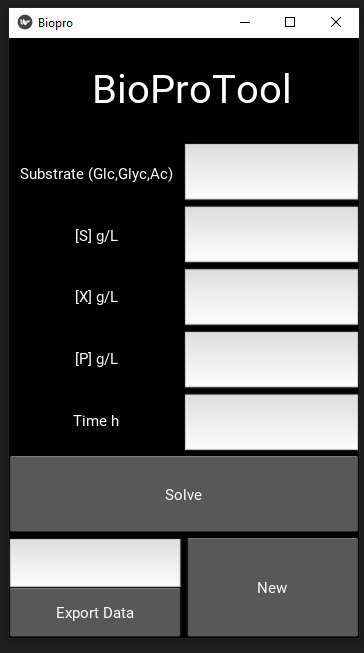

# BioProTool
BioProTool is an small app with the aim of helpping Bioprocess teachers to explain the microbial growth using the Monod's Equation. 

This version counts with a .exe (contact me if you need it) but due to it is a kivy's app would be better for you if you package it for your preferd OS (Windows, iOS, Linux, Android, etc.). 

# How to run it.
 
 You need the python module kivy ( https://kivy.org/#home ), pandas and matplotlib.
 You need both files at the same folder.
 Once you hace all in your system run it this way:
 
 $ python main.py
 
 Select 1 of the 3 substrates. Declare a concentration [S], a initial biomass [X], a product concentration [P].
 If you want to quit the product just leave [P]. 
 Constants are fixed and may not be exacts, are set for teaching porposes. 
 Different substrates have pariticular inhibitory concentration (Are not the real ones, you can set them).
 P is a generi product with an inhibitory concentration.
 
 # Errors
  This tool is error prone but it works for teaching porposes.
  
  No spaces are allowed into the cells that ask for a number.
