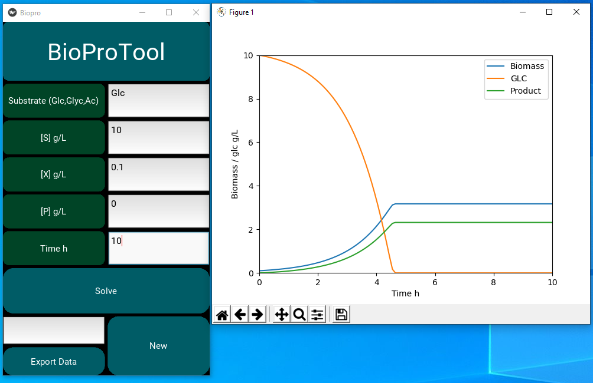

# BioProTool
BioProTool is an small app with the aim of helpping Bioprocess teachers to explain the microbial growth using the Monod's Equation. 

This version counts with a .exe (you can get it here https://drive.google.com/open?id=1fb40Z8odEEO2enEuph0uaUpMr5RlgKGG) ,but due to it is a kivy's app would be better for you if you package it for your prefered OS (Windows, iOS, Linux, Android, etc.). 

# How to run it.

## Using .exe file
Donwload the file and unzip it.
Just run it cicking on the BioProApp.exe, it doesn't need installation. 

## Using terminal and unpackaged files
 You need the python module kivy ( https://kivy.org/#home ), pandas and matplotlib.
 You need both files at the same folder.
 Once you have all in your system run it this way:
 
 $ python main.py
 
 # Once on the user interface
 Select 1 of the 3 substrates. Declare a concentration [S], a initial biomass [X], a product concentration [P].
 If you want to quit the product just leave cell [P] empty (no spaces or tabs). 
 Constants are fixed and may not be exacts, are set for teaching porposes. 
 Different substrates have particular inhibitory concentration (they not the real ones, you can set them).
 P is a generic product with an arbitrary inhibitory concentration.
 Finally, select a time space to observe the culture and click on Solve.

  To export data to an .xlsx file, write a name for the new file and click on Export data. File will be generated in the same folder than the BioProApp.exe or the main.py file.
 
 # Errors
 This tool is error prone but it works for teaching porposes.
 No spaces are allowed into the cells that ask for a number.
 Each time you get a misstake, tha app will close itself. The most frequent reasson is an invalid character at the cell number (like tab or space) or an invalid substrate.
 
